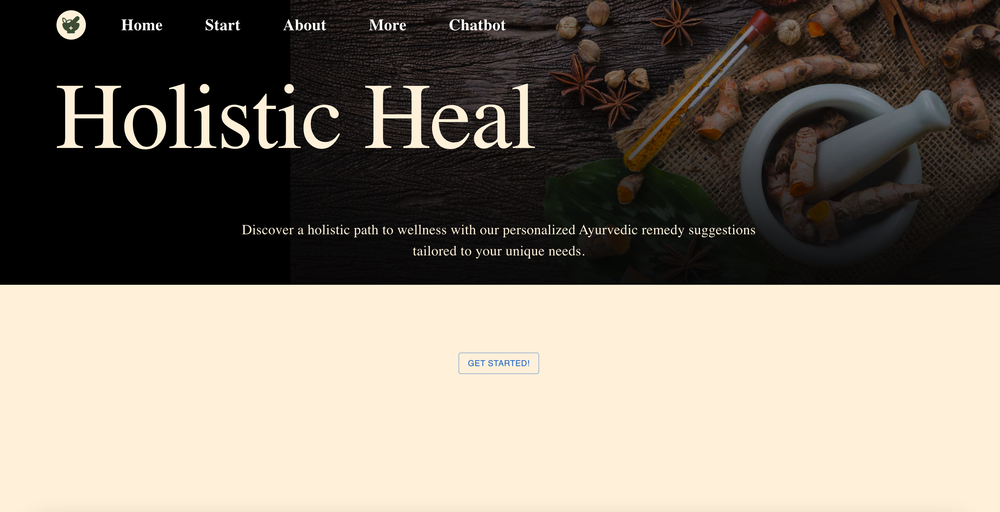
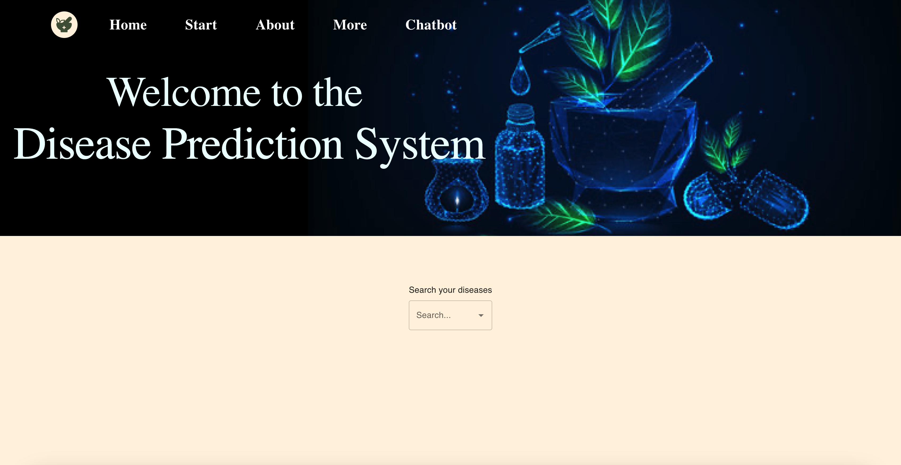
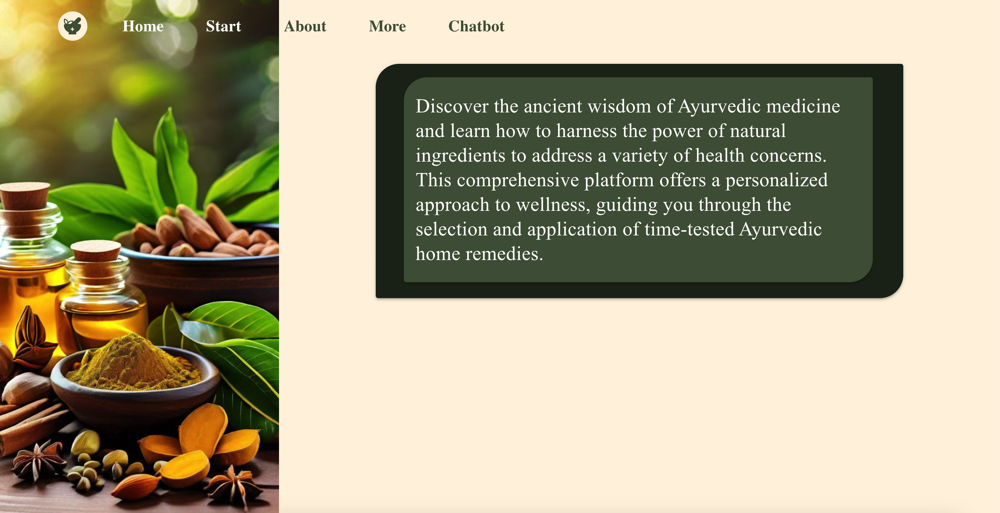

# Holistic Heal

A React web application for personalised Ayurvedic remedy suggestions, combining
a symptom-based disease prediction system with an interactive chatbot and a
curated library of traditional remedies.

**Live:** [vermillion-lily-8d840c.netlify.app](https://vermillion-lily-8d840c.netlify.app/)

---

## Screenshots

### Home


### Disease Prediction System


### Remedy Guidance


### About Ayurveda


---

## Features

- **Disease prediction system** — searchable, filterable dropdown lets users look
  up conditions and receive matched Ayurvedic remedy suggestions
- **Interactive chatbot** — conversational interface for guided remedy discovery
- **Multi-page navigation** — client-side routing across Home, Start, About, More
  and Chatbot views with no full-page reloads
- **Remedy library** — structured content on herbs, spices and natural compounds,
  organised by health concern
- **Responsive layout** — adapts across desktop, tablet and mobile breakpoints

## Tech stack

| Layer | Technology |
|---|---|
| Framework | React (Create React App) |
| Routing | React Router |
| Styling | CSS |
| Deployment | Netlify (continuous deploy from `main`) |

## Architecture

```
src/
  components/     reusable UI components shared across pages
  pages/          Home, Start, About, More, Chatbot
  data/           remedy and condition datasets
  App.js          route definitions
```

The application is component-driven: each page composes shared presentational
components, and state for search and chatbot interactions is held locally in the
components that own it rather than in a global store, keeping the data flow
explicit and easy to follow.

## Running locally

```bash
git clone https://github.com/RITIKA-SHARMAA/ayurvedic-web.git
cd ayurvedic-web
npm install
npm start
```

The app runs at `http://localhost:3000`.

```bash
npm test     # run the test suite
npm run build   # production build
```

## Testing

Component tests are written with **Jest** and **React Testing Library**, covering:

- rendering and default state of core components
- user interactions — search input, dropdown selection, navigation
- edge cases such as empty results and missing data
- error states when a lookup returns nothing

## Roadmap

- Persist chatbot conversation history across sessions
- Expand the condition dataset and add remedy filtering by category
- Accessibility pass — keyboard navigation and ARIA labelling
- Lighthouse performance audit and code-splitting for route-level chunks

## Disclaimer

This project is built for educational and informational purposes. The remedy
suggestions are drawn from publicly available traditional Ayurvedic sources and
are not medical advice. Consult a qualified practitioner for health concerns.
